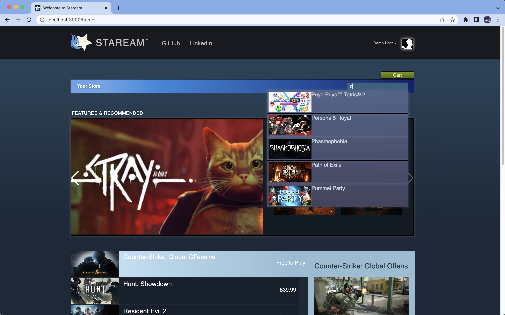
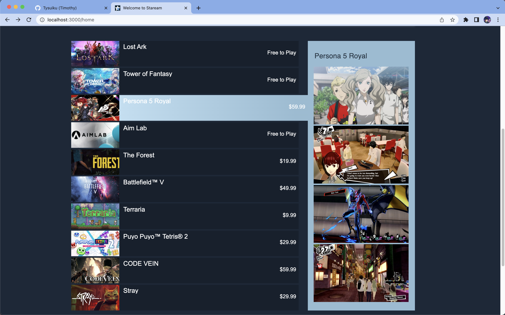
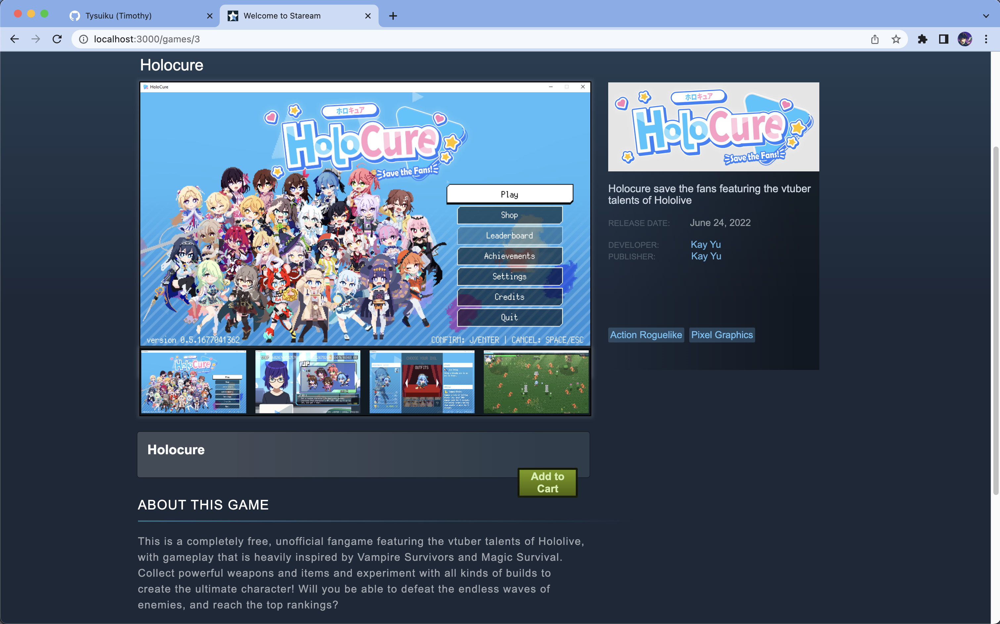
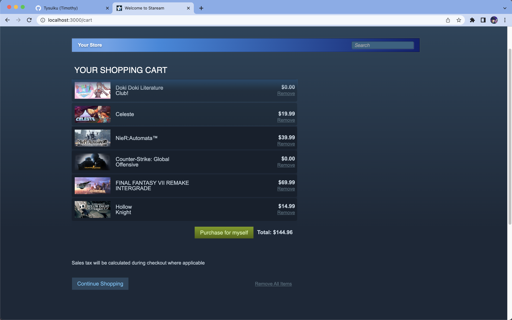
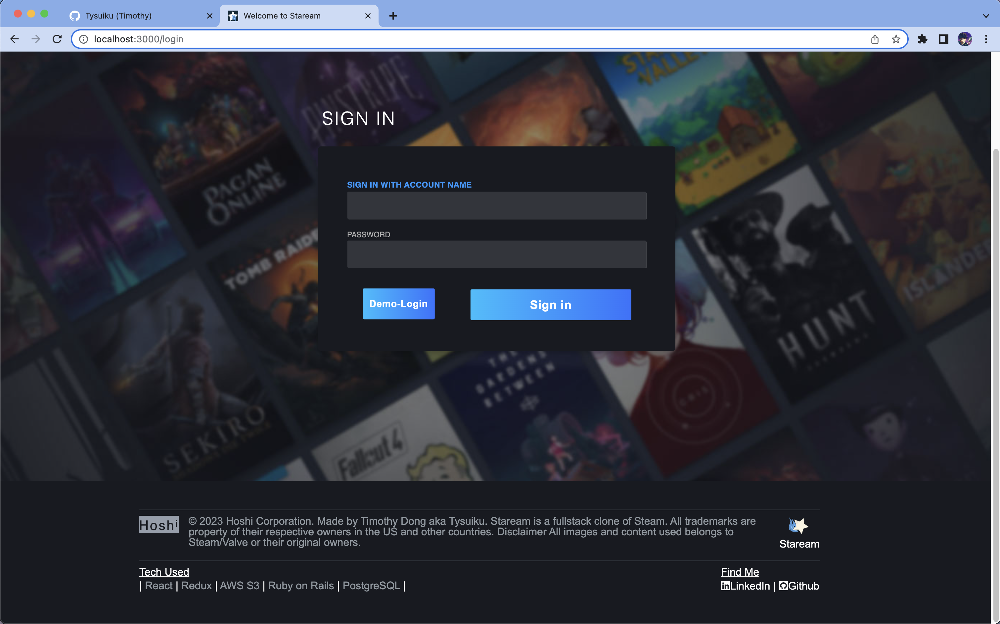

# Staream

Hi! Welcome to Staream, my clone of steam.

To create Staream(star-powered), I utilized React for the frontend and Ruby on Rails for the backend. With this application, users have the ability to browse for different types of games, search for them based on games title, and even add games to cart and purchase them.

Staream can be viewd from https://staream.onrender.com

## Screenshots







## Technologies & Libaries Used

    React
    Redux
    AWS S3
    Javascript
    Ruby on Rails
    PostgreSQL
    JSON / Jbuilder
    HTML
    CSS
    Render
    FontAwesome
    Swiper
    Webpack

## Setup

`npm install --prefix frontend && npm run build --prefix frontend` in root

`rails s`

navigate to `localhost:5000`

## Sample Action and Reducer Using React-Redux

````javascript

```import csrfFetch from "./csrf.js";

const SET_GAMES = "games/SET_GAMES";

export const setGames = (games) => {
  return {
    type: SET_GAMES,
    payload: games,
  };
};

export const fetchGames = () => async (dispatch) => {
  const res = await csrfFetch("/api/games");
  const games = await res.json();
  dispatch(setGames(games));
};


const gamesReducer = (state = {}, action) => {
  switch (action.type) {
    case SET_GAMES:
      return action.payload;
      default:
      return state;
  }
};
````

```

## Future Implementations

    Users should have userpage
    Users can edit profile picture and background picture
    Users can write reviews per game and games should have many reviews
```
